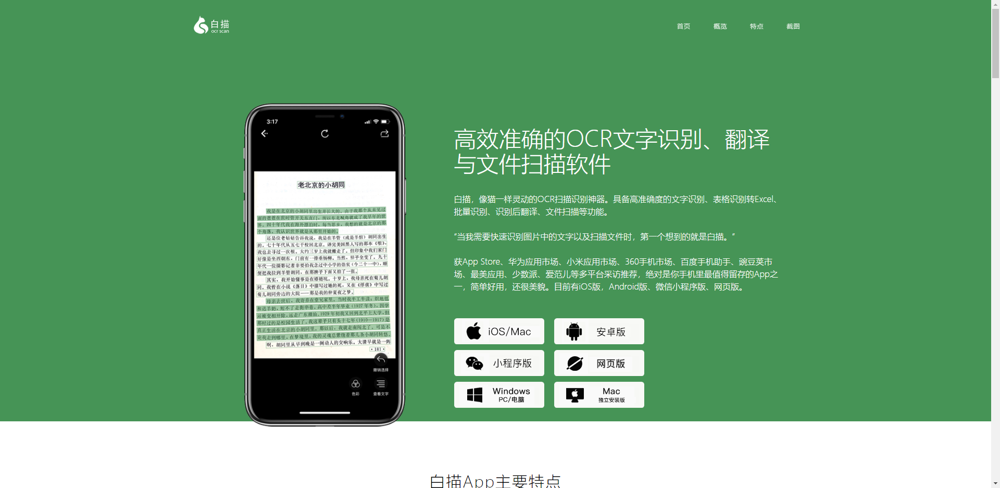
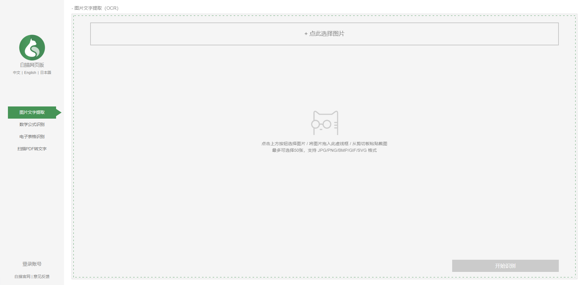
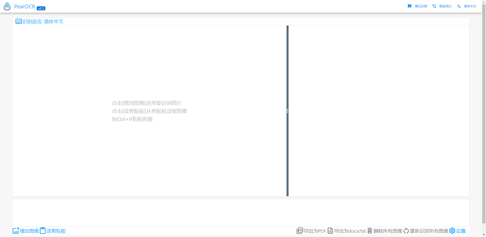
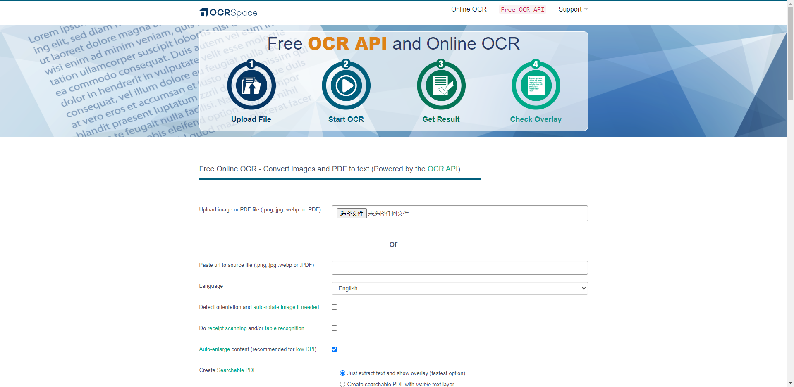
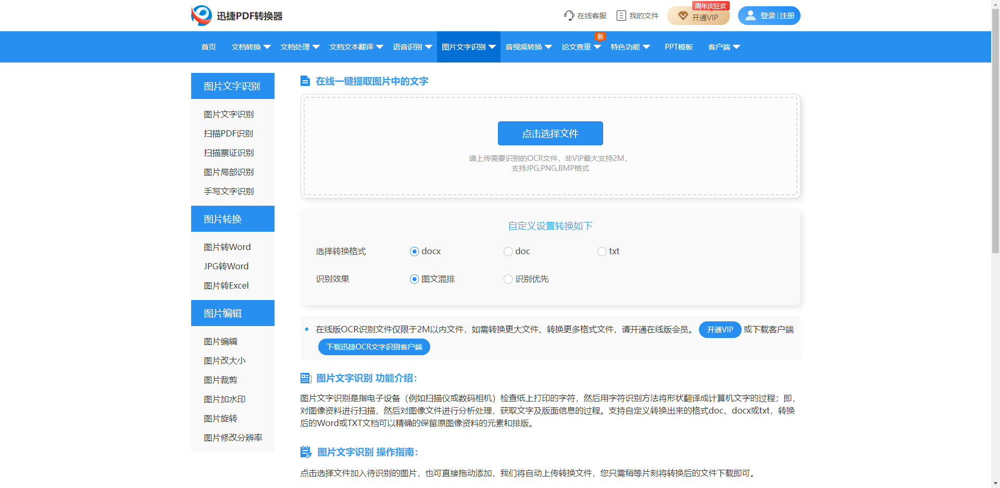
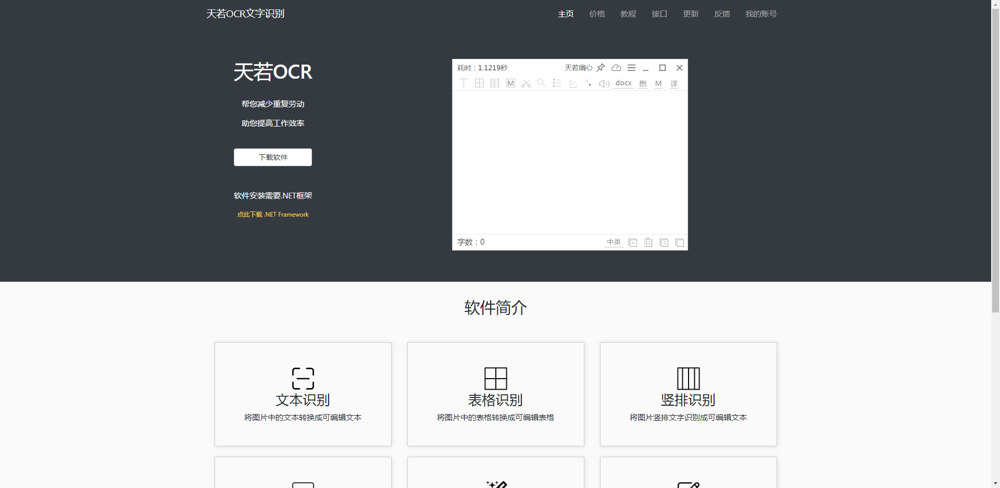
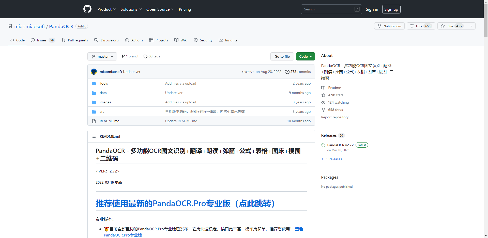

<h1>OCR文字识别网站导航</h1>

<h5>作者：汐小旅Shiory</h5>

## 极客OCR

> 网址：https://gkocr.com/
>
> 极客OCR是一款在线使用光学字符标志软件。服务支持46种语言，包括中文，日文和韩文
>
> 

## 白描OCR

> 网址：https://baimiaoapp.com/
>
> 白描是一款高效准确的OCR文字识别、翻译与文件扫描软件。白描，像猫一样灵动的OCR扫描识别神器。具备高准确度的文字识别、表格识别转Excel、批量识别、识别后翻译、文件扫描等功能
>
> 
>
> 网页端：https://web.baimiaoapp.com/
>
> 

## 泰比ABBYY

> 网址：https://www.abbyy.cn/
>
> ABBYY提供免费文字识别 —— 在线OCR服务，著名的OCR文字识别服务提供商ABBYY提供的在线OCR识别服务，该网站服务当前只支持中文和英文，一次只可上传一个文件，一次最多可以转换三个页面，每天最多可以使用10次免费转换服务。让你转换扫描和拍摄图像、PDF文档到可编辑、复制、搜索的Microsoft Word文件格式。
>
> 

## 风云OCR

> 网址：https://sf.fengyunsoft.cn/fyocr
>
> 风云OCR文字识别包括单张图片，图片批量，截图，票证和PDF文件识别。高效易用、识别率高、支持批量操作、安全可靠的图片转文字软件
>
> 

## PearOCR

> 网址：https://pearocr.com/
>
> PearOCR是永久免费的OCR在线工具
>
> 

## OCRSpace

> 网址：https://ocr.space/
>
> 网上OCR服务免费使用，无需注册。只要上传图像文件。如果需要自动识别OCR并处理很多文档，不要在网上抓取这个页面。相反，请使用提供的免费OCR API。数据是安全的：根据严格的隐私政策，在线OCR服务和OCR API不存储任何数据
>
> 

## 讯飞OCR

> 官网：https://www.iflytek.com/
>
> 网址：https://www.xfyun.cn/services/common-ocr
>
> 基于深度神经网络模型的端到端文字识别系统，将图片（来源如扫描仪或数码相机）中的印刷或手写文字转化为计算机可编辑的文字
>
> 

## Convertio

> 网址：https://convertio.co/zh/ocr/
>
> Convertio是一个专业的在线文档文件转换器，据称可以在线转换任何格式的文档文件，该网站支持的OCR文件格式特别丰富，提供Convertio Chrome插件，可以免费转换10页的文档资料
>
> 

## 迅捷PDF转换器

> 网址：http://app.xunjiepdf.com/ocr
>
> 迅捷PDF转换器是一款转换格式丰富、操作便捷、高保真度的格式转换软件。卓越的性能造就了更多强劲的附加功能，如PDF高级编辑功能、OCR图像识别、语音转文字等等。众多功能提供一站式服务，拒绝为零碎的功能东奔西走。该网站由迅捷PDF提供，可以免费转换2M以内的文件。该网站另有提供 图片局部识别、PDF OCR识别、票证 OCR识别等众多功能
>
> 

======================================以下为开源项目====================================================================

## 天若OCR

> 网址：
>
> http://ocr.tianruo.net/
>
> https://gitee.com/wanglifree/tianruoocr-cl
>
> https://github.com/wangfreexx/wangfreexx-tianruoocr-cl-paddle
>
> https://github.com/AnyListen/tianruoocr
>
> 

## PaddleOCR

> 网址：https://github.com/PaddlePaddle/PaddleOCR   , https://gitee.com/paddlepaddle/PaddleOCR
>
> PaddleOCR是GitHub开源项目，PaddleOCR旨在打造一套丰富、领先、且实用的OCR工具库，助力开发者训练出更好的模型，并应用落地。
>
> 

## PandaOCR

> 网址：https://github.com/miaomiaosoft/PandaOCR
>
> PandaOCR是GitHub开源项目，多功能OCR图文识别+翻译+朗读+弹窗+公式+表格+图床+搜图+二维码
>
> 使用教程：https://www.bilibili.com/video/BV1Vt4y1U7Es/
>
> 

## UmiOCR

> 网址：https://github.com/hiroi-sora/Umi-OCR
>
> UmiOCR是GitHub开源项目，完全免费；解压即用，离线运行，无需网络；可批量导入处理图片，结果保存到本地 txt / md / jsonl 多种格式文件。也可以即时截屏识别；采用 PaddleOCR-json C++ 识别引擎。只要电脑性能足够，通常比在线OCR服务更快；默认使用PPOCR-v3模型库。除了能准确辨认常规文字，对手写、方向不正、杂乱背景等情景也有不错的识别率。可设置**忽略区域**排除水印、设置**文块后处理**合并排版段落，得到规整的文本
>
> 使用教程：https://github.com/hiroi-sora/Umi-OCR/blob/main/README.md
>
> 

## BibiOCR

> 网址：https://github.com/bibiparrot/bibiocr
>
> BibiOCR是GitHub开源项目，离线工具bibiocr就是基于百度paddleocr实现的， 它本质就是DBNet+Text Direction Classification+RCNN的组合网络。离线工具，方便一些保密要求高的人群使用，不用上传图像给外部网站。免安装EXE，点开即用，对于没有管理员权限的机器也可以用，开源放心使用。
>
> 
