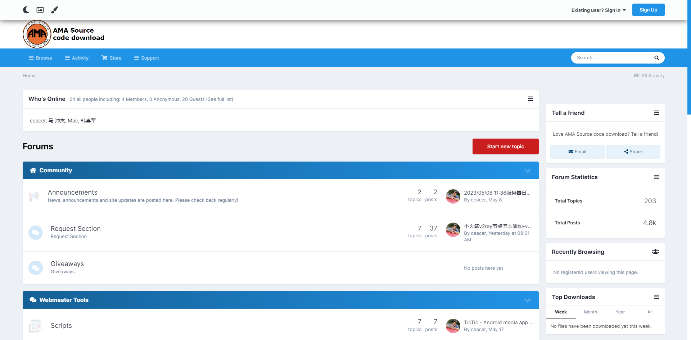
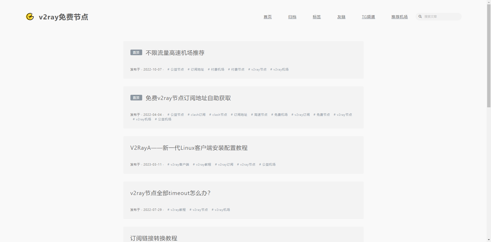
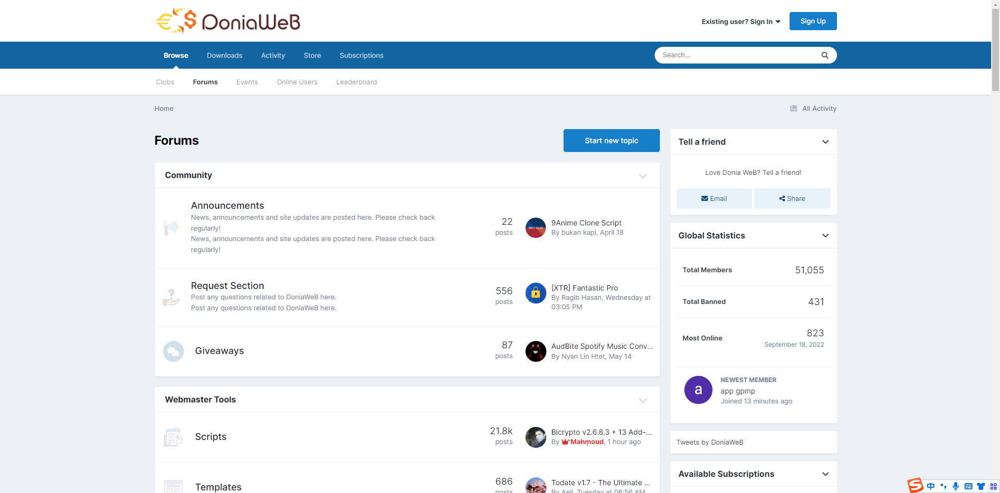

<h1>MOFA网站导航</h1>

<h5>作者：汐小旅Shiory</h5>

# 网站列表

| 名称 | 地址                                                         | 说明                               | 备注 |
| ---- | ------------------------------------------------------------ | ---------------------------------- | ---- |
| 快橙 | [国外](https://qqbooster.com/) (需魔法)；[国内](https://uploadseo.jengsin.com.tw/qq1/tqq231) | 实惠、迅捷、可靠、永远能连上的魔法 |      |

# 工具列表

| 名称            | 地址                                                         | 说明                               | 备注 |
| --------------- | ------------------------------------------------------------ | ---------------------------------- | ---- |
| ClashForWindows | [ClashForWindows](https://github.com/Fndroid/clash_for_windows_pkg)；[帮助文档](https://docs.cfw.lbyczf.com/)；[GitHub帮助文档](https://github.com/Fndroid/clash-win-docs-new) | Clash的Windows/MacOS/Linux客户端   |      |
| Clash           | [GitHub](https://github.com/Dreamacro/clash)；[帮助文档](https://github.com/Dreamacro/clash/wiki) | 一个 Go 语言开发的多平台代理客户端 |      |
| ClashX          | [GitHub](https://github.com/yichengchen/clashX)              | Clash 的 Mac 图形客户端            |      |
| ClashForAndroid | [GitHub](https://github.com/Kr328/ClashForAndroid)           | Clash 的 Android 图形客户端        |      |
| v2rayN          | [GitHub](https://github.com/2dust/v2rayN)                    | Windows 的图形客户端               |      |

# 订阅分享

## AMA

> 网址：[AMA](https://demo.ama.pub/)
>
> 

## v2rayfree

> 网址：[v2rayfree](https://www.v2rayfree.eu.org/)
>
> 

## Donia WeB

> 网址：[DoniaWeB](https://doniaweb.com/)
>
> 

# 短连接生成

## BELINK

> 网址：[BELINK](https://www.ama.pub/)
>
> 